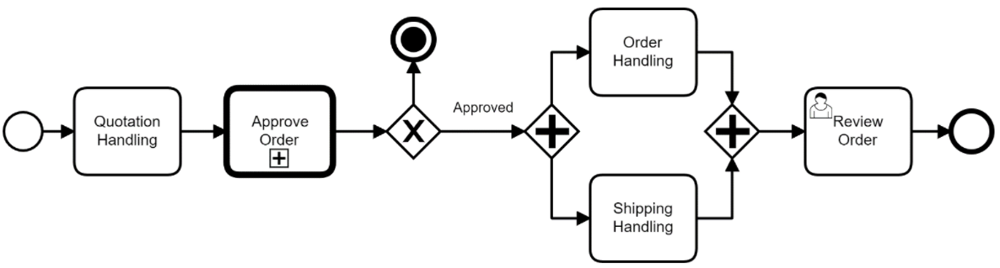
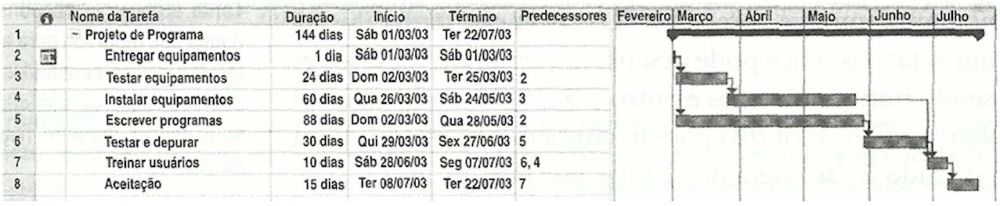

# 2. Especificações do Projeto

A definição exata do problema e os pontos mais relevantes a serem tratados no projeto foi estabelecido com a participação dos usuários por meio de entrevista online com tópicos previamente estipulados. A partir dessa interação consolidamos os dados coletados na forma de personas e histórias de usuários.

## 2.1 Personas

As pessoas retratadas durante o processo de compreensão do problema são apresentadas nas figuras que seguem.

Quadro 1 - Personas

| FOTO               | INFORMAÇÕES COLETADAS                                     |                     
|--------------------|-----------------------------------------------------------|
||**Mateus Ribeiro**    **Idade:** 25 anos |
| | **Ocupação:** Atleta profissional de natação.|
| | **Aplicativos:** _WhatsApp, Instagram, Twitter_.|
| | **Motivações:**  Tem o sonho de ser campeão olímpico.|
| | **Frustrações:** Quando pega uma gripe por que esqueceu de tomar a vacina anual. E isso o impede de treinar.|
| | **_Hobbies_, História:** Faz academia todos os dias pela manhã e se preocupa com a saúde.|

| FOTO               | INFORMAÇÕES COLETADAS                                     |                     
|--------------------|-----------------------------------------------------------|
||**Julieta Ferreira**    **Idade:** 34 anos |
| | **Ocupação:** Professora de ensino fundamental.|
| | **Aplicativos:**_WhatsApp, Linkedin_.|
| | **Motivações:**  O amor pelos filhos e o amor pelo ensino.|
| | **Frustrações:** Quando precisa levar os filhos no médico e não consegue encontrar os cartões de vacina.|
| | **_Hobbies_, História:** Possui um filho especial e constantemente precisa levar os filhos ao médico.|

| FOTO               | INFORMAÇÕES COLETADAS                                     |                     
|--------------------|-----------------------------------------------------------|
||**Miguel Carvalho**    **Idade:** 57 anos |
| | **Ocupação:** Diretor de uma ONG|
| | **Aplicativos:**_WhatsApp, Instagram_.|
| | **Motivações:**  judar crianças carentes.|
| | **Frustrações:** Não conseguir controlar surtos de doenças nas acomodações da ONG.|
| | **_Hobbies_, História:** Diretor de uma ONG que resgata crianças abandonadas.|

| FOTO               | INFORMAÇÕES COLETADAS                                     |                     
|--------------------|-----------------------------------------------------------|
||**Henrique Gomes**    **Idade:** 29 anos |
| | **Ocupação:** Veterinário|
| | **Aplicativos:**_WhatsApp, Instagram, Linkedin_.|
| | **Motivações:**  Ama os animais.|
| | **Frustrações:** Quando os cães não são vacinados e são contaminados pela doença da raiva.|
| | **_Hobbies_, História:** Funcionário de um abrigo de cães. Possui o hábito de vacinar os cães para evitar contágio dos demais.|

| FOTO               | INFORMAÇÕES COLETADAS                                     |                     
|--------------------|-----------------------------------------------------------|
||**Mariana Souza**    **Idade:** 20 anos |
| | **Ocupação:** Estudante de medicina|
| | **Aplicativos:**Twitter_, Tiktok, Instagram_.|
| | **Motivações:** Se formar como cirurgiã geral.|
| | **Frustrações:** Esquecer os prazos das injeções trimestrais e aumentar o risco de gravidez indesejada.|
| | **_Hobbies_, História:** Uma estudante que se preocupa em não engravidar antes de se formar.|

| FOTO               | INFORMAÇÕES COLETADAS                                     |                     
|--------------------|-----------------------------------------------------------|
||**Luana Fernandes **    **Idade:** 42 anos |
| | **Ocupação:** Cozinheira e bartender nas horas vagas.|
| | **Aplicativos:**Twitter_, Tiktok, Instagram_.|
| | **Motivações:** Comprar sua casa própria.|
| | **Frustrações:** Ficar doente e não conseguir agendar novos trabalhos.|
| | **_Hobbies_, História:** Um mulher simples que faz trabalhos extra como bartender.|

Fonte: Elaborado pelos autores

## 2.2 Histórias de Usuários

Registramos as histórias de usuários no quadro abaixo, diante da informação coletada do dia a dia das personas identificadas para o projeto.

Quadro 2 - História de Usuários

|EU COMO... `PERSONA`                          | QUERO/PRECISO ... `FUNCIONALIDADE`                           |PARA ... `MOTIVO/VALOR`                                 |
|----------------------------------------------|--------------------------------------------------------------|--------------------------------------------------------|
|Mateus Ribeiro (Atleta de natação)            |Controlar vacinas anuais.                                     |Não contrair doenças infecciosas e ser impedido de treinar.|
|Julieta Ferreira (Professora)                 |Pesquisar informações sobre vacinas tomadas.                  |Ficar mais fácil quando precisar levar os filhos no médico.|
|Miguel Carvalho  (Diretor)                    |Reunir as informações de vacinas das crianças encontradas.    |Facilitar o controle de doenças contagiosas como sarampo, por exemplo.  |
|Henrique Gomes (Veterinário)                  |Registrar as informações de vacinas dos cães.                 |Mantér o cartão de vacina dos animais atualizado.|
|Mariana Souza (Estudante)                     |Criar um lembrete das injeções trimestrais                    |Controlar sua prevenção e diminuir o risco de gravidez indesejada.                 |
|Luana Fernandes (Cozinheira e bartender)      |Agendar as vacinas de gripe.                                  |Para evitar ficar doente e perder dias de trabalho.| 

Fonte: Elaborado pelos autores

## 2.3 Modelagem do Processo de Negócio 

### 2.3.1 Análise da Situação Atual

Apresente aqui os problemas existentes que viabilizam sua proposta. Apresente o modelo do sistema como ele funciona hoje. Caso sua proposta seja inovadora e não existam processos claramente definidos, apresente como as tarefas que o seu sistema pretende implementar são executadas atualmente, mesmo que não se utilize tecnologia computacional. 

### 2.3.2 Descrição Geral da Proposta

Apresente aqui uma descrição da sua proposta abordando seus limites e suas ligações com as estratégias e objetivos do negócio. Apresente aqui as oportunidades de melhorias.

### 2.3.3 Processo 1 – NOME DO PROCESSO

Apresente aqui o nome e as oportunidades de melhorias para o processo 1. Em seguida, apresente o modelo do processo 1, descrito no padrão BPMN. 

### 2.3.4 Processo 2 – NOME DO PROCESSO

Apresente aqui o nome e as oportunidades de melhorias para o processo 2. Em seguida, apresente o modelo do processo 2, descrito no padrão BPMN.

## 2.4 Indicadores de Desempenho

Apresente aqui os principais indicadores de desempenho e algumas metas para o processo. Atenção: as informações necessárias para gerar os indicadores devem estar contempladas no diagrama de classe. Colocar no mínimo 5 indicadores. 

Usar o seguinte modelo: 

Obs.: todas as informações para gerar os indicadores devem estar no diagrama de classe a ser apresentado a posteriori. 

## 2.5 Requisitos

O propósito funcional do projeto é definido por meio dos requisitos funcionais que descrevem ações que o sistema deve estar apto a executar, assim como os requisitos não funcionais que descrevem os atributos que o sistema deve possuir de maneira geral. Estes requisitos são relacionados nas tabelas a seguir.

### 2.5.1 Requisitos Funcionais

Apresentamos a seguir os requisitos funcionais que o projeto deverá atender.

Quadro x - Requisitos Funcionais

|ID    | Descrição do Requisito  | Prioridade |
|------|-----------------------------------------|----|
|RF-001| Permitir que o usuário cadastre tarefas | ALTA | 
|RF-002| Emitir um relatório de tarefas no mês   | MÉDIA |

### 2.5.2 Requisitos não Funcionais

Apresentamos a seguir os requisitos não funcionais que o projeto deverá atender.

Qaudro x - Requisitos Não-Funcionais

|ID     | Descrição do Requisito  |Prioridade |
|-------|-------------------------|----|
|RNF-001| O sistema deve ser responsivo para rodar em um dispositivos móvel | MÉDIA | 
|RNF-002| Deve processar requisições do usuário em no máximo 3s |  BAIXA | 

## 2.6 Restrições

Apresentamos na tabela abaixo, tópicos consideráveis que limitam a execução do projeto e que se configuram como encargos necessários para seu desenvolvimento.

Quadro x - Restrições

|ID| Restrição                                             |
|--|-------------------------------------------------------|
|01| O projeto deverá ser entregue até o final do semestre |
|02| Não pode ser desenvolvido um módulo de backend        |

Enumere as restrições à sua solução. Lembre-se de que as restrições geralmente limitam a solução candidata.

> **Links Úteis**:
> - [O que são Requisitos Funcionais e Requisitos Não Funcionais?](https://codificar.com.br/requisitos-funcionais-nao-funcionais/)
> - [O que são requisitos funcionais e requisitos não funcionais?](https://analisederequisitos.com.br/requisitos-funcionais-e-requisitos-nao-funcionais-o-que-sao/)

## 2.7 Diagrama de Casos de Uso

O diagrama de caso de uso, comumente oriundo da especificação dos requisitos funcionais do sistema, descreve as principais funcionalidades do sistema que será projetado pelo grupo e sua interação com os possíveis usuários (DevMedia, 2022). Segundo Ivar Jacobson, podemos dizer que um caso de uso é um "documento narrativo que descreve a sequência de eventos de um ator que usa um sistema para completar um processo" (Wikipédia, 2020).

Graficamente é representado com elementos como os atores, os casos de uso e seus relacionamentos entre si. Seu objetivo principal é ilustrar de forma abstrata, a interação dos elementos externos com as funcionalidades do sistema, ou seja, “a finalidade de um diagrama de caso de uso é apresentar um tipo de diagrama de contexto que apresenta os elementos externos de um sistema e as maneiras segundo as quais eles as utilizam” (Wikipédia, 2020).

Desta feita, o grupo representa abaixo o diagrama de caso de uso para o sistema que será projetado.

Figura X - Diagrama de Casos de Uso

Fonte: Elaborado pelos autores

Quadro X - Casos de Uso

| ATOR         | DESCRIÇÃO                                                                      |
|--------------|--------------------------------------------------------------------------------|
| Usuário      | Integrante familiar que usará o aplicativo.                                    |

| CASO DE USO              | DESCRIÇÃO                                                                           | REQUISITO FUNCIONAL |
|--------------------------|-------------------------------------------------------------------------------------|---------------------|
| Criar conta              | O usuário deve criar uma conta para utilizar os serviços oferecidos pela aplicação. | RF-001/006 |
| Alterar dados cadastrais | O usuário pode fazer alterações em seu cadastro.                                    | RF-008     |
| Excluir conta            | O usuário pode excluir sua conta quando assim o desejar.                            | RF-00X     |
| Fazer _login_            | O usuário deve fazer _login_ para acessar sua conta.                                | RF-007     |
| Redefinir senha          | O usuário pode redefinir sua senha se necessário.                                   | RF-00X     |
| Cadastrar vacina         | O usuário pode cadastrar as vacinas já tomadas e/ou pendentes.                      | RF-009     |
| Consultar vacina         | O usuário pode consultar as vacinas já tomadas e/ou pendentes.                      | RF-002/003 |
| Editar vacina            | O usuário pode editar/alterar as vacinas já tomadas e/ou pendentes.                 | RF-010     |

Fonte: Elaborado pelos autores

# 3. Matriz de Rastreabilidade

A matriz de rastreabilidade é uma ferramenta usada para explicitar a relação e para facilitar a visualização desse relacionamento direto dos requisitos entre si ou com outros artefatos ou componentes do projeto. Com ela tonrna-se possível rastrear a origem dos requisitos, os elos que os ligam com outros elementos, encontrar inconsistências e garantir que os diferentes níveis do projeto estejam alinhados entre si (ESPINHA, 2022).

Nossa matriz contempla todos os requisitos funcionais e não funcionais que fazem parte do sistema, conforme a figura meramente ilustrativa apresentada a seguir.

Figura x - Matriz de Rastreabilidade

# 4. Gerenciamento de Projeto

De acordo com o PMBoK v6 as dez áreas que constituem os pilares para gerenciar projetos, e que caracterizam a multidisciplinaridade envolvida, são: Integração, Escopo, Cronograma (Tempo), Custos, Qualidade, Recursos, Comunicações, Riscos, Aquisições, Partes Interessadas. Para desenvolver projetos um profissional deve se preocupar em gerenciar todas essas dez áreas. Elas se complementam e se relacionam, de tal forma que não se deve apenas examinar uma área de forma estanque. É preciso considerar, por exemplo, que as áreas de Escopo, Cronograma e Custos estão muito relacionadas. Assim, se eu amplio o escopo de um projeto eu posso afetar seu cronograma e seus custos.

## 4.1 Gerenciamento de Tempo

Com diagramas bem organizados que permitem gerenciar o tempo nos projetos, o gerente de projetos agenda e coordena tarefas dentro de um projeto para estimar o tempo necessário de conclusão.

O gráfico de Gantt ou diagrama de Gantt também é uma ferramenta visual utilizada para controlar e gerenciar o cronograma de atividades de um projeto. Com ele, é possível listar tudo que precisa ser feito para colocar o projeto em prática, dividir em atividades e estimar o tempo necessário para executá-las.

## 4.2 Gerenciamento de Equipe

O gerenciamento de uma equipe aborda várias estratégias, dentre elas reduzir conflitos, melhorar os indicadores, engajar/motivar a equipe, otimizar valores, conceder _feedbacks_, entre outras, mas todas em busca do principal objetivo: atingir o propósito apresentado no projeto.

A organização da equipe está apresentada conforme abaixo:

a) _Scrum Master_
  *	Fabiana Bicalho Palhano Rocha Cossenzo

b) _Product Owner_
  * Eduardo Lordeiro Alves

c) Equipe de Desenvolvimento
  * Eduardo Lordeiro Alves
  * Fabiana Bicalho Palhano Rocha Cossenzo
  * Felipe Costa Moreira
  * Nayara Katlin Oliveira da Silva
  * Rafael Pacheco Leite
  * Raíssa Araújo Oliveira Queiroz Lopes
  
d) Equipe de _Design_ 
  * Eduardo Lordeiro Alves
  * Fabiana Bicalho Palhano Rocha Cossenzo
  * Felipe Costa Moreira
  * Nayara Katlin Oliveira da Silva
  * Rafael Pacheco Leite
  * Raíssa Araújo Oliveira Queiroz Lopes

## 4.3 Gestão de Orçamento

O processo de determinar o orçamento do projeto é uma tarefa que depende, além dos produtos (saídas) dos processos anteriores do gerenciamento de custos, também de produtos oferecidos por outros processos de gerenciamento, como o escopo e o tempo.

