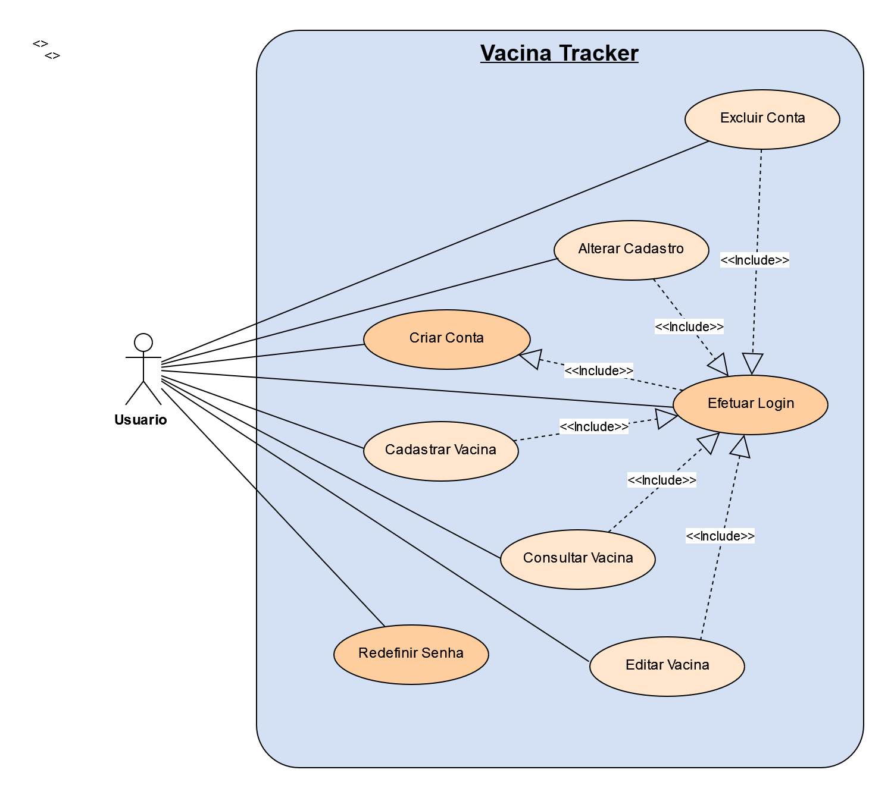

# 2. Especificações do Projeto

A definição exata do problema e os pontos mais relevantes a serem tratados no projeto foi estabelecido com a participação dos usuários por meio de entrevista online com tópicos previamente estipulados. A partir dessa interação consolidamos os dados coletados na forma de personas e histórias de usuários.

## 2.1 Personas

As pessoas retratadas durante o processo de compreensão do problema são apresentadas nas figuras que seguem.

Quadro 1 - Personas

| FOTO               | INFORMAÇÕES COLETADAS                                     |                     
|--------------------|-----------------------------------------------------------|
||**Mateus Ribeiro**    **Idade:** 25 anos |
| | **Ocupação:** Atleta profissional de natação.|
| | **Aplicativos:** _WhatsApp, Instagram, Twitter_.|
| | **Motivações:**  Tem o sonho de ser campeão olímpico.|
| | **Frustrações:** Quando pega uma gripe por que esqueceu de tomar a vacina anual. E isso o impede de treinar.|
| | **_Hobbies_, História:** Faz academia todos os dias pela manhã e se preocupa com a saúde.|

| FOTO               | INFORMAÇÕES COLETADAS                                     |                     
|--------------------|-----------------------------------------------------------|
||**Julieta Ferreira**    **Idade:** 34 anos |
| | **Ocupação:** Professora de ensino fundamental.|
| | **Aplicativos:** _WhatsApp, Linkedin_.|
| | **Motivações:**  O amor pelos filhos e o amor pelo ensino.|
| | **Frustrações:** Quando precisa levar os filhos no médico e não consegue encontrar os cartões de vacina.|
| | **_Hobbies_, História:** Possui um filho especial e constantemente precisa levar os filhos ao médico.|

| FOTO               | INFORMAÇÕES COLETADAS                                     |                     
|--------------------|-----------------------------------------------------------|
||**Miguel Carvalho**    **Idade:** 57 anos |
| | **Ocupação:** Diretor de uma ONG|
| | **Aplicativos:** _WhatsApp, Instagram_.|
| | **Motivações:**  Ajudar crianças carentes.|
| | **Frustrações:** Não conseguir controlar surtos de doenças nas acomodações da ONG.|
| | **_Hobbies_, História:** Diretor de uma ONG que resgata crianças abandonadas.|

| FOTO               | INFORMAÇÕES COLETADAS                                     |                     
|--------------------|-----------------------------------------------------------|
||**Mariana Souza**    **Idade:** 20 anos |
| | **Ocupação:** Estudante de medicina|
| | **Aplicativos:** _Twitter, Tiktok, Instagram_.|
| | **Motivações:** Se formar como cirurgiã geral.|
| | **Frustrações:** Esquecer os prazos das injeções trimestrais e aumentar o risco de gravidez indesejada.|
| | **_Hobbies_, História:** Uma estudante que se preocupa em não engravidar antes de se formar.|

| FOTO               | INFORMAÇÕES COLETADAS                                     |                     
|--------------------|-----------------------------------------------------------|
||**Luana Fernandes**    **Idade:** 42 anos |
| | **Ocupação:** Cozinheira e _bartender_ nas horas vagas.|
| | **Aplicativos:** _Twitter, Tiktok, Instagram_.|
| | **Motivações:** Comprar sua casa própria.|
| | **Frustrações:** Ficar doente e não conseguir agendar novos trabalhos.|
| | **_Hobbies_, História:** Uma mulher simples que faz trabalhos extra como _bartender_.|

Fonte: Elaborado pelos autores

## 2.2 Histórias de Usuários

Registramos as histórias de usuários no quadro abaixo, diante da informação coletada do dia a dia das personas identificadas para o projeto.

Quadro 2 - História de Usuários

|EU COMO... `PERSONA`                          | QUERO/PRECISO ... `FUNCIONALIDADE`                           |PARA ... `MOTIVO/VALOR`                            |
|----------------------------------------------|--------------------------------------------------------------|---------------------------------------------------|
|Mateus Ribeiro (Atleta de natação)            |Controlar vacinas anuais.                                     |Não contrair doenças infecciosas e ser impedido de treinar.|
|Julieta Ferreira (Professora)                 |Pesquisar informações sobre vacinas tomadas.                  |Ficar mais fácil quando precisar levar os filhos no médico.|
|Miguel Carvalho  (Diretor)                    |Reunir as informações de vacinas das crianças encontradas.    |Facilitar o controle de doenças contagiosas como sarampo, por exemplo.  |
|Mariana Souza (Estudante)                     |Criar um lembrete das injeções trimestrais                    |Controlar sua prevenção e diminuir o risco de gravidez indesejada. |
|Luana Fernandes (Cozinheira e bartender)      |Agendar as vacinas de gripe.                                  |Para evitar ficar doente e perder dias de trabalho.| 

Fonte: Elaborado pelos autores

## 2.3 Modelagem do Processo de Negócio 

### 2.3.1 Análise da Situação Atual

Hoje em dia o uso de papel é algo considerado ultrapassado e com espaço limitado, sendo necessário utilização de outras folhas para que sejam colocadas as devidas atualizações, sem contar que este processo é feito manualmente pelas pessoas, e ainda existe o transtorno de perder um cartão de vacina, que é algo de extrema importância. No entanto para resolver esta problemática, pensamos em um sistema para que essas vacinas sejam registradas de forma mais fácil e organizada.

Considerando o cenário  atual, boa parte das pessoas têm acesso a um computador, _tablet_ ou _smartphone_. Nossa proposta é aproveitar o acesso à tecnologia e desenvolver uma aplicação móvel em que os usuários tenham na palma das suas mãos um total controle de suas vacinas. 

###  2.3.2 Descrição Geral da Proposta

O aplicativo Vacina Tracker oferece acesso e controle de todo histórico de vacinas e atualizações na palma das mãos. Com o aplicativo, suas vacinas e de membros da família podem ser registradas de forma mais fácil, rápida e organizada. No aplicativo você pode ter controle das vacinas que já tomou, qual foi a dose, data e até mesmo quando e qual é a próxima vacina que você precisa tomar, além de poder incluir membros para ter o controle dos mesmos. Nele será possível armazenar e buscar informações, histórico, vacinas pendentes, entre outros, isso tudo com qualidade, rapidez, eficiência e total controle de suas informações.

### 2.3.3 Processo 1 - VISÃO GERAL DO PROCESSO

Conforme descrito nos diagramas de fluxos realizados no contexto deste projeto, o fluxo do processo principal foi mapeado e elaborado conforme as notações de negócio do padrão BPMN. O diagrama abaixo é condizente com o processo COMPLETO que o projeto Vacina Tracker teria, caso realizado na prática.

O processo começa com o cadastro/_login_ do usuário, usuário cria ou seleciona membros, segue para a escolha para alteração do cadastro dos usuários e termina com o usuário cadastrando e gerando o seu histórico e/ou de seus dependentes.

Abaixo foram descritos os processos de:

* Processo de cadastro do usuário responsável; 
* Processo de cadastro de vacina via usuário responsável;
* Solicitação de listagem de vacinas cadastradas pelo usuário.

Figura 1 - Processo Completo

Fonte: Elaborado pelos autores

### 2.3.4 Processo 2 - CADASTRO DO USUÁRIO

Neste diagrama de notação BPMN, foi elaborado pelo grupo uma visão mais minuciosa dos processos que a aplicação Vacina Tracker realiza em seus processos lógicos e funcionais, sendo mais especificamente o Processo de Cadastro de Usuário.

O processo começa com o cadastro/_login_ do usuário, parte para visualização e leitura dos Termos e Condições de Uso e das Políticas de Privacidade, segue para a adição/seleção (opcional) de membros e termina com o usuário podendo editar o seu cadastro, assim como cadastrar vacinas.

Figura 2 - Processo de Cadastro do Usuário

Fonte: Elaborado pelos autores

### 2.3.5 Processo 3 - CADASTRO DE VACINAS

Já neste diagrama de notação BPMN, foi elaborado pelo grupo uma visão mais minuciosa dos processos que a aplicação Vacina Tracker realiza em seus processos lógicos e funcionais, como o Processo de Cadastro de Vacinas.

O processo começa com o cadastro das vacinas, parte para visualização da cartela de vacinas cadastradas, segue para a escolha entre as opções e termina com o usuário visualizando seu histórico e/ou de seus dependentes, separados entre si. Os detalhes do processo estão descritos nesta notação.

Figura 3 - Processo de Cadastro de Vacinas

Fonte: Elaborado pelos autores

## 2.4 Indicadores de Desempenho

Congênere Rabello (2022), através dos indicadores de desempenho é possível avaliar a efetividade das ações e a performance do negócio, sendo um importante guia para a tomada de decisões, além de medir o sucesso e performance da empresa ao longo do tempo. Os indicadores podem oferecer resultados quantitativos e qualitativos, ajudando a ter o máximo de informações possíveis e necessárias para análise dos dados.

Quadro 3 - Indicadores de Desempenho

(inserir quadro)

Fonte: Elaborado pelos autores

## 2.5 Requisitos

O propósito funcional do projeto é definido por meio dos requisitos funcionais que descrevem ações que o sistema deve estar apto a executar, assim como os requisitos não funcionais que descrevem os atributos que o sistema deve possuir de maneira geral. Estes requisitos são relacionados nas tabelas a seguir.

### 2.5.1 Requisitos Funcionais

Apresentamos a seguir os requisitos funcionais que o projeto deverá atender.

Quadro 4 - Requisitos Funcionais

| ID    | Descrição do Requisito                                      | Prioridade |
|-------|-------------------------------------------------------------|------------|
| RF-01 | O aplicativo deve permitir cadastrar os membros da família. | MÉDIA |
| RF-02 | O aplicativo deve mostrar o histórico das vacinas cadastradas pelo usuário. | ALTA |
| RF-03 | O aplicativo deve separar o histórico das vacinas cadastradas para cada membro da família.| ALTA |
| RF-04 | O aplicativo deve permitir realizar a conferência de informações como: local, data da imunização, nome da vacina, data da próxima dose.| BAIXA |
| RF-05 | O aplicativo deve permitir o cadastro de usuários. | ALTA |
| RF-06 | O aplicativo deve permitir que o usuário faça _login_ em sua conta através do seu _e-mail_ e senha cadastrados. | ALTA |
| RF-07 | O aplicativo deve permitir ao usuário gerenciar seu cadastro. | ALTA |
| RF-08 | O aplicativo deverá emitir um alerta/lembrete para futuras vacinas e/ou vacinas pendentes.| BAIXA |
| RF-09 | O aplicativo deve permitir ao usuário gerenciar o cadastro das vacinas. | ALTA |
| RF-10 | O aplicativo deve permitir acesso à documentação de termos e condições de uso e de políticas de privacidade. | MÉDIA |
| RF-11 | O aplicativo deve permitir ao usuário solicitar a redefinição de senha. | BAIXA |
| RF-12 | O aplicativo deve permitir ao usuário criar uma conta. | ALTA |

Fonte: Elaborado pelos autores

### 2.5.2 Requisitos Não Funcionais

Apresentamos a seguir os requisitos não funcionais que o projeto deverá atender.

Quadro 5 - Requisitos Não-Funcionais

| ID      | Descrição do Requisito                                                                                         | Prioridade |
| ------- | -------------------------------------------------------------------------------------------------------------- | ---------- |
| RNF-01 | O sistema de ser feito usando práticas de _UX e IxD_.                                                           | ALTA       |
| RNF-02 | O sistema deve ser disponibilizado publicamente no _GitHub_.                                                    | ALTA       |
| RNF-03 | O sistema deve apresentar baixo tempo de resposta nas requisições.                                              | ALTA       |
| RNF-04 | O sistema deve estar de acordo com a Lei Geral de Proteção de Dados (LGPD).                                     | ALTA       |
| RNF-05 | O sistema deve ser implementado em uma linguagem para dispositivo móvel e aplicação _Web_.                      | ALTA       |
| RNF-06 | O sistema deve ser responsivo e compatível com os principais navegadores e sistemas operacionais do mercado.    | ALTA       |
| RNF-07 | O sistema deve estar disponível pelo menos 99% das 24 horas do dia, nos 07 dias da semana.                      | ALTA       |

Fonte: Elaborado pelos autores

## 2.6 Restrições

Apresentamos na tabela abaixo, tópicos consideráveis que limitam a execução do projeto e que se configuram como encargos necessários para seu desenvolvimento.

Quadro 6 - Restrições

| ID    | Restrição                                                    |
| ----- | ------------------------------------------------------------ |
| RE-01 | O projeto deverá ser entregue até o final do semestre        |
| RE-02 | A equipe não pode subcontratar o desenvolvimento do trabalho. |
| RE-03 | O Projeto deve ser desenvolvido em uma linguagem para uma aplicação distribuída. |
| RE-04 | O aplicativo deve se restringir às tecnologias propostas pelo curso. |
| RE-05 | A rotina de estudos da faculdade e do projeto deve se adequar e ser compartilhado com a família e o trabalho remunerado. |
| RE-06 | A organização do projeto e do grupo deve possibilitar sua execução de forma assíncrona. |

Fonte: Elaborado pelos autores

## 2.7 Diagrama de Casos de Uso

O diagrama de caso de uso, comumente oriundo da especificação dos requisitos funcionais do sistema, descreve as principais funcionalidades do sistema que será projetado pelo grupo e sua interação com os possíveis usuários (DevMedia, 2022). Segundo Ivar Jacobson, podemos dizer que um caso de uso é um "documento narrativo que descreve a sequência de eventos de um ator que usa um sistema para completar um processo" (Wikipédia, 2020).

Graficamente é representado com elementos como os atores, os casos de uso e seus relacionamentos entre si. Seu objetivo principal é ilustrar de forma abstrata, a interação dos elementos externos com as funcionalidades do sistema, ou seja, “a finalidade de um diagrama de caso de uso é apresentar um tipo de diagrama de contexto que apresenta os elementos externos de um sistema e as maneiras segundo as quais eles as utilizam” (Wikipédia, 2020).

Desta feita, o grupo representa abaixo o diagrama de caso de uso para o sistema que será projetado.

Figura 4 - Diagrama de Casos de Uso

Fonte: Elaborado pelos autores

Quadro 7 - Casos de Uso

| ATOR           | DESCRIÇÃO                                                                      |
|----------------|--------------------------------------------------------------------------------|
| Usuário        | Integrante familiar que usará o aplicativo.                                    |
| Banco de Dados | Ator que receberá a requisição do caso de uso _Lembrar Vacina_.                                    |

| CASO DE USO                    	| DESCRIÇÃO                                                                       	   | REQUISITO FUNCIONAL |
|---------------------------------|--------------------------------------------------------------------------------------|---------------------|
| Criar conta                     | O usuário deve criar uma conta para utilizar os serviços oferecidos pela aplicação.  | RF-012              |
| Alterar dados cadastrais        | O usuário pode fazer alterações em seu cadastro.                                	   | RF-007 	           |
| Excluir conta           	      | O usuário pode excluir sua conta quando assim desejar.                             	| RF-007 	            |
| Fazer Login             	      | O usuário deve fazer _login_ para acessar sua conta.                               	| RF-006 	            |
| Redefinir senha                	| O usuário pode redefinir sua senha se necessário.                                  	| RF-011 	            |
| Gerenciar Vacina     	          | O usuário pode cadastrar, consultar ou editar as vacinas já tomadas e/ou pendentes. | RF-002/003/004/009  |
| Cadastrar Membro Familiar       | O usuário pode cadastrar um membro da família ou dependente.             	          | RF-001/005	         |
| Lembrar Vacina       	          | O sistema emitirá um alerta para vacinas futuras ou pendentes.             	        | RF-008	             |
| Acessar Política de Privacidade | O usuário pode acessar a política de privacidade.                                  	| RF-010	             |

| PRÉ-REQUISITO E RELACIONAMENTOS | DESCRIÇÃO                                             	                                                            |
|---------------------------------|---------------------------------------------------------------------------------------------------------------------|
| PRÉ-REQUISITO                | O usuário deve estar logado para os casos de uso: _Gerenciar Cadastro_, _Cadastrar Membro Familiar_, _Gerenciar Vacina_ e _Lembrar Vacina_. |
| INCLUSÃO   	                 | Ao criar conta será incluído o caso de uso _Fazer Login_.                                            |
| EXTENSÃO   	                 | Se o usuário esquecer sua senha poderá redefinir informando seu e-mail de cadastro.  Para o caso de uso _Acessar Política de Privacidade_ o usuário não precisará ter efetuado _login_, mas  para aceitar os termos ele deve estar logado no sistema. |

Fonte: Elaborado pelos autores

# 3. Matriz de Rastreabilidade

A matriz de rastreabilidade é uma ferramenta usada para explicitar a relação e para facilitar a visualização desse relacionamento direto dos requisitos entre si ou com outros artefatos ou componentes do projeto. Com ela tonrna-se possível rastrear a origem dos requisitos, os elos que os ligam com outros elementos, encontrar inconsistências e garantir que os diferentes níveis do projeto estejam alinhados entre si (ESPINHA, 2022).

Nossa matriz contempla todos os requisitos funcionais e casos de uso que fazem parte do sistema, conforme a figura meramente ilustrativa apresentada a seguir.

Figura 5 - Matriz de Rastreabilidade

Fonte: Elaborado pelos autores

Veja [aqui](https://docs.google.com/spreadsheets/d/1GHACQIs1BArVdLQ-MwobDlJtP5jnmCfx/edit#gid=1924698943) nossa Matriz de Rastreabilidade de Requisitos completa.

# 4. Gerenciamento de Projeto

De acordo com o PMBoK v6 as dez áreas que constituem os pilares para gerenciar projetos, e que caracterizam a multidisciplinaridade envolvida, são: Integração, Escopo, Cronograma (Tempo), Custos, Qualidade, Recursos, Comunicações, Riscos, Aquisições, Partes Interessadas. Para desenvolver projetos um profissional deve se preocupar em gerenciar todas essas dez áreas. Elas se complementam e se relacionam, de tal forma que não se deve apenas examinar uma área de forma estanque. É preciso considerar, por exemplo, que as áreas de Escopo, Cronograma e Custos estão muito relacionadas. Assim, se eu amplio o escopo de um projeto eu posso afetar seu cronograma e seus custos.

## 4.1 Gerenciamento de Tempo

Com diagramas bem organizados que permitem gerenciar o tempo nos projetos, o gerente de projetos agenda e coordena tarefas dentro de um projeto para estimar o tempo necessário de conclusão.

Figura 6 - Cronograma

Fonte: Elaborado pelos autores

O gráfico de _Gantt_ ou diagrama de _Gantt_ também é uma ferramenta visual utilizada para controlar e gerenciar o cronograma de atividades de um projeto. Com ele, é possível listar tudo que precisa ser feito para colocar o projeto em prática, dividir em atividades e estimar o tempo necessário para executá-las.

Figura 7 - Gráfico de _Gantt_

Fonte: Elaborado pelos autores

## 4.2 Gerenciamento de Equipe

O gerenciamento de uma equipe aborda várias estratégias, dentre elas reduzir conflitos, melhorar os indicadores, engajar/motivar a equipe, otimizar valores, conceder _feedbacks_, entre outras, mas todas em busca do principal objetivo: atingir o propósito apresentado no projeto.

A organização da equipe está apresentada conforme abaixo:

Figura 8 - Gerenciamento de Equipe

  
Fonte: Elaborado pelos autores

## 4.3 Gestão de Orçamento

A gestão financeira de um projeto ajuda a estimar os gastos e orçamentos do projeto. De acordo com Dias (2023), é de extrema importância que o cronograma esteja alinhado com o planejamento dos custos do projeto, com a finalidade de que os imprevistos sejam minimizados ao longo de sua execução, conforme o Guia de referência PMBoK.

Para a elaboração da tabela de orçamento a seguir, foram considerados os custos em um período de 06 (seis) meses, para a contratação de 04 (quatro) stakeholders, 04 (quatro) estações de trabalho, assinatura de plano de acesso à internet com IP fixo, licença de _software_ de desenvolvimento e da infraestrutura de um local físico.

Figura 9 - Orçamento

Fonte: Elaborado pelos autores
