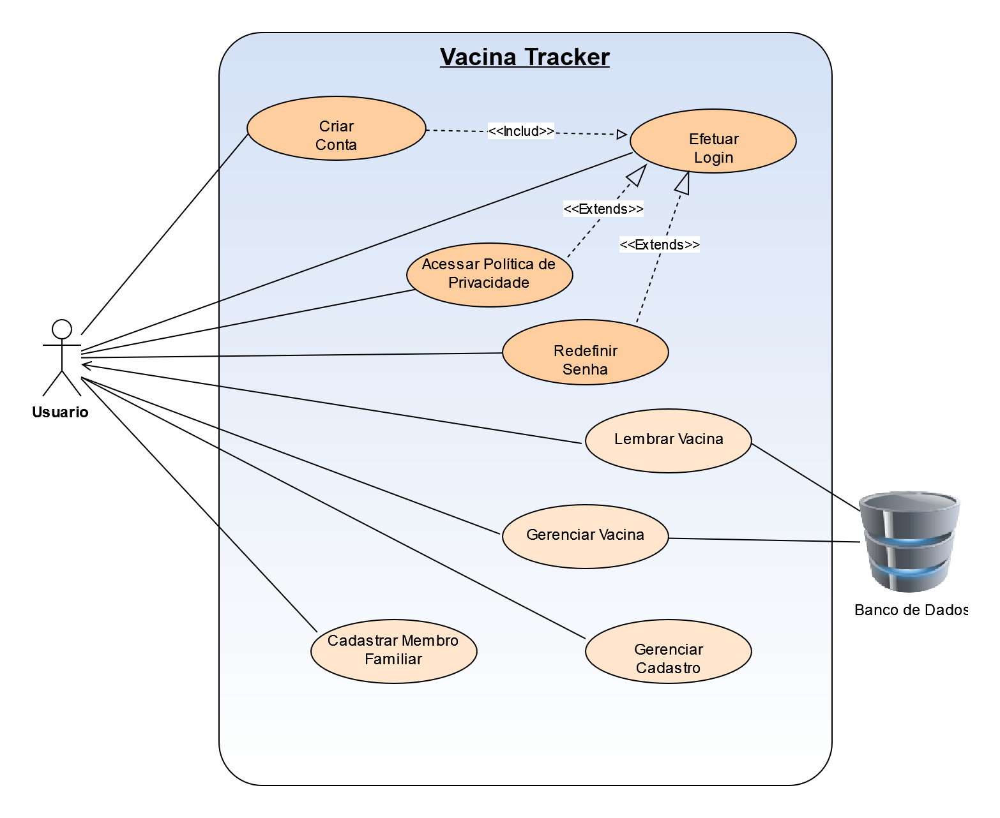

# Especificações do Projeto

A definição exata do problema e os pontos mais relevantes a serem tratados no projeto foi estabelecido com a participação dos usuários por meio de entrevista online com tópicos previamente estipulados. A partir dessa interação consolidamos os dados coletados na forma de personas e histórias de usuários.

## Personas

| Mateus Ribeiro    |                                    |                                        |                     
|--------------------|------------------------------------|----------------------------------------|
|IMAGEM |**Idade:** 25 anos - **Ocupação:** Atleta profissional de natação|**Aplicativos:** _WhatsApp, Instagram, Twitter_.|
|**Motivações:** Tem o sonho de ser campeão olímpico.|**Frustrações:** Quando pega uma gripe por que esqueceu de tomar a vacina anual. E isso o impede de treinar.|**_Hobbies_, História:** Faz academia todos os dias pela manhã e se preocupa com a saúde.|

| Julieta Ferreira   |                                    |                                        |                     
|--------------------|------------------------------------|----------------------------------------|
|IMAGEM |**Idade:** 34 anos - **Ocupação:** Professora de ensino fundamental |**Aplicativos:** _WhatsApp, Linkedin_.|
|**Motivações:** O amor pelos filhos e o amor pelo ensino. |**Frustrações:** Quando precisa levar os filhos no médico e não consegue encontrar os cartões de vacina.|**_Hobbies_, História:** Possui um filho especial e constantemente precisa levar os filhos ao médico.|

| Miguel Carvalho    |                                    |                                        |
|--------------------|------------------------------------|----------------------------------------|
|IMAGEM |**Idade:** 57 anos - **Ocupação:** Diretor de uma ONG |**Aplicativos:** _WhatsApp, Instagram_.|
|**Motivações:** Ajudar crianças carentes.|**Frustrações:** Não conseguir controlar surtos de doenças nas acomodações da ONG. |**_Hobbies_, História:** Diretor de uma ONG que resgata crianças abandonadas.|

| Henrique Gomes     |                                    |                                        |
|--------------------|------------------------------------|----------------------------------------|
|IMAGEM   |**Idade:** 29 anos - **Ocupação:** Veterinário |**Aplicativos:** _WhatsApp, Instagram, Linkedin_.|
|**Motivações:**  Ama os animais.|**Frustrações:**  Quando os cães não são vacinados e são contaminados pela doença da raiva.|**_Hobbies_, História:** Funcionário de um abrigo de cães. Possui o hábito de vacinar os cães para evitar contágio dos demais.|

| Mariana Souza      |                                    |                                        |                    
|--------------------|------------------------------------|----------------------------------------|
|IMAGEM |**Idade:** 20 anos - **Ocupação:** Estudante de medicina|**Aplicativos:** Twitter_, Tiktok, Instagram_.|
|**Motivações:**  Se formar como cirurgiã geral.|**Frustrações:** Esquecer os prazos das injeções trimestrais e aumentar o risco de gravidez indesejada. |**_Hobbies_, História:** Uma estudante que se preocupa em não engravidar antes de se formar.|

| Luana Fernandes  |                                    |                                        |
|--------------------|------------------------------------|----------------------------------------|
|IMAGEM  |**Idade:** 42 anos - **Ocupação:** Cozinheira e bartender nas horas vagas.  | **Aplicativos:** WhatsApp_.|
|**Motivações:** Comprar sua casa própria. |**Frustrações:** Ficar doente e não conseguir agendar novos trabalhos.  |**_Hobbies_, História:** Um mulher simples que faz trabalhos extra como bartender.|

Fonte: Elaborado pelos autores

## Histórias de Usuários

Registramos as histórias de usuários no quadro abaixo, diante da informação coletada do dia a dia das personas identificadas para o projeto.

Quadro 2 - História de Usuários

|EU COMO... `PERSONA`                          | QUERO/PRECISO ... `FUNCIONALIDADE`                           |PARA ... `MOTIVO/VALOR`                                 |
|----------------------------------------------|--------------------------------------------------------------|--------------------------------------------------------|
|Mateus Ribeiro (Atleta de natação)            |Controlar vacinas anuais.                                     |Não contrair doenças infecciosas e ser impedido de treinar.|
|Julieta Ferreira (Professora)                 |Pesquisar informações sobre vacinas tomadas.                  |Ficar mais fácil quando precisar levar os filhos no médico.|
|Miguel Carvalho  (Diretor)                    |Reunir as informações de vacinas das crianças encontradas.    |Facilitar o controle de doenças contagiosas como sarampo, por exemplo.  |
|Henrique Gomes (Veterinário)                  |Registrar as informações de vacinas dos cães.                 |Mantér o cartão de vacina dos animais atualizado.|
|Mariana Souza (Estudante)                     |Criar um lembrete das injeções trimestrais                    |Controlar sua prevenção e diminuir o risco de gravidez indesejada.                 |
|Luana Fernandes (Cozinheira e bartender)      |Agendar as vacinas de gripe.                                  |Para evitar ficar doente e perder dias de trabalho.| 

Fonte: Elaborado pelos autores

## Modelagem do Processo de Negócio 

### Análise da Situação Atual

Apresente aqui os problemas existentes que viabilizam sua proposta. Apresente o modelo do sistema como ele funciona hoje. Caso sua proposta seja inovadora e não existam processos claramente definidos, apresente como as tarefas que o seu sistema pretende implementar são executadas atualmente, mesmo que não se utilize tecnologia computacional. 

### Descrição Geral da Proposta

Apresente aqui uma descrição da sua proposta abordando seus limites e suas ligações com as estratégias e objetivos do negócio. Apresente aqui as oportunidades de melhorias.

### Processo 1 – NOME DO PROCESSO

Apresente aqui o nome e as oportunidades de melhorias para o processo 1. Em seguida, apresente o modelo do processo 1, descrito no padrão BPMN. 

### Processo 2 – NOME DO PROCESSO

Apresente aqui o nome e as oportunidades de melhorias para o processo 2. Em seguida, apresente o modelo do processo 2, descrito no padrão BPMN.

## Indicadores de Desempenho

Apresente aqui os principais indicadores de desempenho e algumas metas para o processo. Atenção: as informações necessárias para gerar os indicadores devem estar contempladas no diagrama de classe. Colocar no mínimo 5 indicadores. 

Usar o seguinte modelo: 

Obs.: todas as informações para gerar os indicadores devem estar no diagrama de classe a ser apresentado a posteriori. 

## Requisitos

As tabelas que se seguem apresentam os requisitos funcionais e não funcionais que detalham o escopo do projeto. Para determinar a prioridade de requisitos, aplicar uma técnica de priorização de requisitos e detalhar como a técnica foi aplicada.

### Requisitos Funcionais

|ID    | Descrição do Requisito  | Prioridade |
|------|-----------------------------------------|----|
|RF-001| Permitir que o usuário cadastre tarefas | ALTA | 
|RF-002| Emitir um relatório de tarefas no mês   | MÉDIA |

### Requisitos não Funcionais

|ID     | Descrição do Requisito  |Prioridade |
|-------|-------------------------|----|
|RNF-001| O sistema deve ser responsivo para rodar em um dispositivos móvel | MÉDIA | 
|RNF-002| Deve processar requisições do usuário em no máximo 3s |  BAIXA | 

Com base nas Histórias de Usuário, enumere os requisitos da sua solução. Classifique esses requisitos em dois grupos:

- [Requisitos Funcionais
 (RF)](https://pt.wikipedia.org/wiki/Requisito_funcional):
 correspondem a uma funcionalidade que deve estar presente na
  plataforma (ex: cadastro de usuário).
- [Requisitos Não Funcionais
  (RNF)](https://pt.wikipedia.org/wiki/Requisito_n%C3%A3o_funcional):
  correspondem a uma característica técnica, seja de usabilidade,
  desempenho, confiabilidade, segurança ou outro (ex: suporte a
  dispositivos iOS e Android).
Lembre-se que cada requisito deve corresponder à uma e somente uma
característica alvo da sua solução. Além disso, certifique-se de que
todos os aspectos capturados nas Histórias de Usuário foram cobertos.

## Restrições

O projeto está restrito pelos itens apresentados na tabela a seguir.

|ID| Restrição                                             |
|--|-------------------------------------------------------|
|01| O projeto deverá ser entregue até o final do semestre |
|02| Não pode ser desenvolvido um módulo de backend        |

Enumere as restrições à sua solução. Lembre-se de que as restrições geralmente limitam a solução candidata.

> **Links Úteis**:
> - [O que são Requisitos Funcionais e Requisitos Não Funcionais?](https://codificar.com.br/requisitos-funcionais-nao-funcionais/)
> - [O que são requisitos funcionais e requisitos não funcionais?](https://analisederequisitos.com.br/requisitos-funcionais-e-requisitos-nao-funcionais-o-que-sao/)

## Diagrama de Casos de Uso

O diagrama de caso de uso, comumente oriundo da especificação dos requisitos funcionais do sistema, descreve as principais funcionalidades do sistema que será projetado pelo grupo e sua interação com os possíveis usuários (DevMedia, 2022). Segundo Ivar Jacobson, podemos dizer que um caso de uso é um "documento narrativo que descreve a sequência de eventos de um ator que usa um sistema para completar um processo" (Wikipédia, 2020).

Graficamente é representado com elementos como os atores, os casos de uso e seus relacionamentos entre si. Seu objetivo principal é ilustrar de forma abstrata, a interação dos elementos externos com as funcionalidades do sistema, ou seja, “a finalidade de um diagrama de caso de uso é apresentar um tipo de diagrama de contexto que apresenta os elementos externos de um sistema e as maneiras segundo as quais eles as utilizam” (Wikipédia, 2020).

Desta feita, o grupo representa abaixo o diagrama de caso de uso para o sistema que será projetado.

Figura X - Diagrama de Casos de Uso

Fonte: Elaborado pelos autores

Quadro X - Casos de Uso

| ATOR         | DESCRIÇÃO                                                                      |
|--------------|--------------------------------------------------------------------------------|
| Usuário      | Integrante familiar que usará o aplicativo.                                    |

| CASO DE USO              | DESCRIÇÃO                                                                           | REQUISITO FUNCIONAL |
|--------------------------|-------------------------------------------------------------------------------------|---------------------|
| Criar conta              | O usuário deve criar uma conta para utilizar os serviços oferecidos pela aplicação. | RF-001/006 |
| Alterar dados cadastrais | O usuário pode fazer alterações em seu cadastro.                                    | RF-008     |
| Excluir conta            | O usuário pode excluir sua conta quando assim o desejar.                            | RF-00X     |
| Fazer _login_            | O usuário deve fazer _login_ para acessar sua conta.                                | RF-007     |
| Redefinir senha          | O usuário pode redefinir sua senha se necessário.                                   | RF-00X     |
| Cadastrar vacina         | O usuário pode cadastrar as vacinas já tomadas e/ou pendentes.                      | RF-009     |
| Consultar vacina         | O usuário pode consultar as vacinas já tomadas e/ou pendentes.                      | RF-002/003 |
| Editar vacina            | O usuário pode editar/alterar as vacinas já tomadas e/ou pendentes.                 | RF-010     |

Fonte: Elaborado pelos autores

# Matriz de Rastreabilidade

A matriz de rastreabilidade é uma ferramenta usada para facilitar a visualização dos relacionamento entre requisitos e outros artefatos ou objetos, permitindo a rastreabilidade entre os requisitos e os objetivos de negócio. 

A matriz deve contemplar todos os elementos relevantes que fazem parte do sistema, conforme a figura meramente ilustrativa apresentada a seguir.

> **Links Úteis**:
> - [Artigo Engenharia de Software 13 - Rastreabilidade](https://www.devmedia.com.br/artigo-engenharia-de-software-13-rastreabilidade/12822/)
> - [Verificação da rastreabilidade de requisitos usando a integração do IBM Rational RequisitePro e do IBM ClearQuest Test Manager](https://developer.ibm.com/br/tutorials/requirementstraceabilityverificationusingrrpandcctm/)
> - [IBM Engineering Lifecycle Optimization – Publishing](https://www.ibm.com/br-pt/products/engineering-lifecycle-optimization/publishing/)

# Gerenciamento de Projeto

De acordo com o PMBoK v6 as dez áreas que constituem os pilares para gerenciar projetos, e que caracterizam a multidisciplinaridade envolvida, são: Integração, Escopo, Cronograma (Tempo), Custos, Qualidade, Recursos, Comunicações, Riscos, Aquisições, Partes Interessadas. Para desenvolver projetos um profissional deve se preocupar em gerenciar todas essas dez áreas. Elas se complementam e se relacionam, de tal forma que não se deve apenas examinar uma área de forma estanque. É preciso considerar, por exemplo, que as áreas de Escopo, Cronograma e Custos estão muito relacionadas. Assim, se eu amplio o escopo de um projeto eu posso afetar seu cronograma e seus custos.

## Gerenciamento de Tempo

Com diagramas bem organizados que permitem gerenciar o tempo nos projetos, o gerente de projetos agenda e coordena tarefas dentro de um projeto para estimar o tempo necessário de conclusão.

O gráfico de Gantt ou diagrama de Gantt também é uma ferramenta visual utilizada para controlar e gerenciar o cronograma de atividades de um projeto. Com ele, é possível listar tudo que precisa ser feito para colocar o projeto em prática, dividir em atividades e estimar o tempo necessário para executá-las.

## Gerenciamento de Equipe

O gerenciamento adequado de tarefas contribuirá para que o projeto alcance altos níveis de produtividade. Por isso, é fundamental que ocorra a gestão de tarefas e de pessoas, de modo que os times envolvidos no projeto possam ser facilmente gerenciados. 

## Gestão de Orçamento

O processo de determinar o orçamento do projeto é uma tarefa que depende, além dos produtos (saídas) dos processos anteriores do gerenciamento de custos, também de produtos oferecidos por outros processos de gerenciamento, como o escopo e o tempo.

